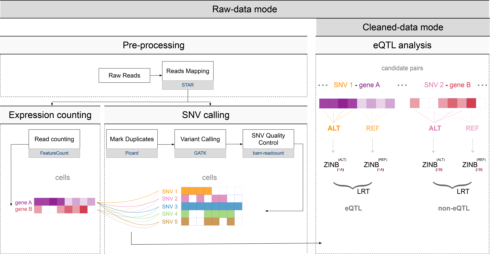
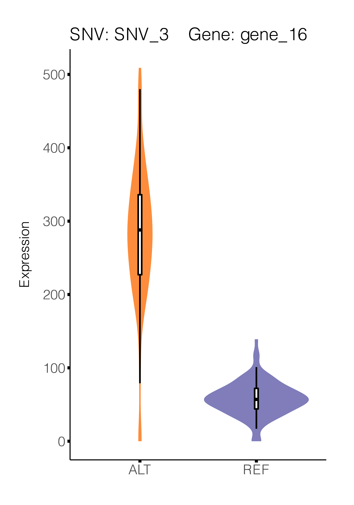

<figure>
<figcaption>eQTLsingle_overview</figcaption>
</figure>

Introduction
------------

**`eQTLsingle`** is an R package for **discovering eQTLs from scRNA-seq
data only**. It detects mutations from scRNA-seq data and models gene
expression of different genotypes with the zero-inflated negative
binomial (ZINB) model to find associations between genotypes and
phenotypes at single-cell level.

**`eQTLsingle`** has two modes.

-   Cleaned-data mode: take input as SNV matrix and expression matrix
    from single cells. If you have had SNV and expression information of
    the same cell before, you can use this mode to discover eQTLs

-   Raw-data mode: take input as raw scRNA-seq data (fastq data).
    eQTLsingle can generate both SNV matrix and gene matrix, and
    discovers eQTLs based them

Installation
------------

To install the **`eQTLsingle`** from
[**GitHub**](https://github.com/horsedayday/eQTLsingle/):

``` r
if(!require(devtools)) install.packages("devtools")
devtools::install_github("horsedayday/eQTLsingle", build_vignettes = TRUE)
```

To load the installed **`eQTLsingle`** in R:

``` r
library(eQTLsingle)
```

Mode 1: Cleaned-data mode
-------------------------

This mode takes input as cleaned SNV matrix and expression matrix (the
right part shown in the figure above).

### Input

**`eQTLsingle`** takes two inputs: `snvMatrix` and `expressionMatrix`.

-   `snvMatrix`: A dataframe, describes genotype of SNVs (loci by
    cells), rownames of this dataframe are SNVid, colnames of this
    dataframe are Cell ids. (1) -1 indicates missing data (no sufficient
    reads covered); (2) 0 indicates genotype of this locus is REF
    (non-mutated); (3) 1 indicates genotype of this locus is ALT
    (mutated)

-   `expressionMatrix`: A dataframe, describes gene expressions (gene
    expressions by cells), rownames of this dataframe are Geneid,
    colnames of this dataframe are CellId.

### Usage

#### Step1: Build SNV-gene pairs

We only conduct eQTL analysis on valid mutations and genes. So we need
to select high reliable SNV-gene pairs first (both SNV and genes cover
enough cells).

``` r
# Load eQTLsingle and test data (SNV matrix and expression matrix)
library(eQTLsingle)
data("toy_snvMatrix")
data("toy_expressionMatrix")
# select valid SNV-gene pairs
# each genotype at least covers 30 cells
# each gene (expression level > 1) at least covers 30 cells
snv.gene.pair.metadata <- eQTLsingle_build_metadata(snvMatrix = toy_snvMatrix,
                                                    expressionMatrix = toy_expressionMatrix, 
                                                    snv.number.of.cells = 30, 
                                                    expression.min = 1, 
                                                    expression.number.of.cells = 30)
```

Format of `snv.gene.pair.metadata`,

-   `SNVid`: Id of SNV, represented as CHR\_\_POS
-   `Num_cells_ref`: Num\_cells\_ref: number of cells in REF group
-   `Num_cells_alt`: Num\_cells\_alt: number of cells in ALT group
-   `Ref_cells`: cell list of REF group
-   `Alt_cells`: cell list of ALT group
-   `GeneList`: gene list, these genes will be tested with the SNV in
    this row
-   `Num_gene`: number of genes in gene list
-   `CellList`: whole cell list of REF and ALT group

#### Step 2: Conduct eQTL analysis on valid SNV-gene pairs.

``` r
# conduct eQTL analysis on valid SNV-gene pairs
eQTL.result <- eQTLsingle(toy_expressionMatrix,
                          snv.gene.pair.metadata)
```

Format of `eQTL.result`,

-   `SNVid`: Id of SNV, represented as CHR\_\_POS
-   `Geneid`: gene id of target gene
-   `sample_size_Ref`, `sample_size_Alt`: number of cells in REF and ALT
    group
-   `theta_Ref`, `theta_Alt`, `mu_Ref`, `mu_Alt`, `size_Ref`,
    `size_Alt`, `prob_Ref`, `prob_Alt`: estimated parameters of ZINB for
    REF group and ALT group
-   `total_mean_Ref`, `total_mean_Alt`: mean of the REF group and ALT
    group
-   `foldChange`: fold change of mean of REF group (`total_mean_Ref`)
    with respect to mean of ALT group (`total_mean_Alt`)
-   `chi2LR1`: chi square statistic for the test
-   `pvalue`, `adjusted_pvalue`: pvalue and adjusted pvalue of the test.
    If adjusted p-value is smaller than some threshold, this SNV shows
    significant eQTL effect on the target gene
-   `Remark`: to record abnormity

#### \[Optional\] Step 3: Visualize eQTL effect

``` r
# Suppose we are interested at the pair between 
# SNV with snvid "SNV_3" 
# gene with geneid "gene_16"

# select out a SNV-gene pair
eQTL.result.target <- eQTL.result[(eQTL.result$SNVid == "SNV_3") &
                                    (eQTL.result$Geneid == "gene_16"),]

# to draw violin plots of gene expression in both REF group and ALT group
eQTLsingle_visualization(eQTL.result.target,toy_expressionMatrix, snv.gene.pair.metadata)
```

<figure>
<figcaption>visualization_plot</figcaption>
</figure>

Mode 2: Raw-data mode
---------------------

If you only have FASTQ data and want to use our script to generate
expression matrix and SNV matrix (the left part shown in the figure
above), you can run shell scripts stored in `./inst/`. You can execute
these scripts from R environment directly, but we recommend you to use
it in shell. There are two parts,

1.  *Pre-processing*: generate both mutation profile and expression
    profiles from FASTQ data

2.  *SNV quality control*: count read number over selected SNVs and
    confirm valid mutations for further eQTL analysis

You need to install some dependencies for pre-processing and SNV quality
control,

### Dependencies

-   `samtools`
-   `featureCounts`
-   `GATK`
-   `picard`
-   `java`
-   `bam-readcount`
-   `Python3`
-   `Pandas`

### Usage

#### Step 1: Pre-processing (generating SNV matrix and expression matrix)

You can get the help document by running following command in *shell*

    ./eQTLsingle-Preprocessing.sh --help

Default operations are:

1.  Build index for mapping software STAR

2.  Mapping from Fastq files to Bam files; Building gene expression
    matrix

3.  SNV calling from Bam files

-   If you want to use the full function, i.e., (1)(2)(3), you need to
    set the following arguments:

<!-- -->

        --ref <file>                    Reference genome
        
        --gtf <file>                    Genome annotation
        
        --input-fastq-dir <folder>      Folder of Fastq files
        
        --output-dir <folder>           Output folder to store index of STAR, Bam files, gene expression matrix, SNV calling results, etc.
        
        --picard <file>                 Path to picard.jar file
        
        --refsnp <file>                 Path to reference on SNP, e.g., dbsnp_138.hg19.vcf
        
        --refindel <file>               Path to reference on indel, e.g., 1000G_phase1.indels.hg19.sites.vcf
        
        [--parallel <num>]              Number of files processed in parallel, optional argument, default value is 1

-   If you only want to use part of utilities, you can use ignore
    argument to ignore specific operation:

<!-- -->

        --ignore-build-index            To ignore the index building step
        --ignore-mapping                To ignore the mapping and quantification step
        --ignore-SNV-calling            To ignore the SNV calling step

For example,

-   If you want to get full results including both gene expression
    matrix and SNV matrix from raw reads (fastq files), your command is
    like:

<!-- -->

    ./eQTLsingle-Preprocessing.sh --ref ref_file --gtf gtf_file --input-fastq-dir fastq_folder --outut-dir output_folder --picard picard_file --refsnp ref_snp_file --refindel ref_indel_file --parallel 2

-   If you just want to mapping (including building index), your command
    is like:

<!-- -->

    ./eQTLsingle-Preprocessing.sh --ref ref_file --gtf gtf_file --input-fastq-dir fastq_folder --outut-dir output_folder --ignore-SNV-calling

-   If you just want to do SNV calling, your command is like the command
    below. Note that, you need to put bam files in output\_folder/bam

<!-- -->

    ./eQTLsingle-Preprocessing.sh --ref ref_file --gtf gtf_file --outut-dir output_folder --picard picard_file --refsnp ref_snp_file --refindel ref_indel_file --ignore-build-index --ignore-mapping

The structure of output is

    output_folder
    │   
    │
    └─── bam
    │   │   cell_1_Aligned.sortedByCoord.out.bam
    |   |   cell_1_Log.final.out
    │   │   cell_2_Aligned.sortedByCoord.out.bam
    |   |   cell_2_Log.final.out
    |   |   ...
    │   
    └─── mapping_stat
    |   │   mapping_stat.csv
    |    
    |─── quantification_stats
    |   │─── cell_level_files
    |   |   │  cell_1.featurecounts
    |   |   │  cell_1.featurecounts.summary
    |   |   │  cell_2.featurecounts
    |   |   │  cell_2.featurecounts.summary
    |   |   | ...
    |   |─── gene_expression_matrix
    |   |   |  gene_expression_matrix.csv
    |   |   |  featurecounts_summary_matrix.csv
    |   
    |─── snv
    |   │─── cell_level_snv
    |   |   │  cell_1_filtered_pass.vcf
    |   |   │  cell_1_gatk.bam
    |   |   │  cell_2_filtered_pass.vcf
    |   |   │  cell_2_gatk.bam
    |   |   |  ...
    |   |─── snv_matrix
    |   |   │  SNV_matrix.csv
    |    
    |─── star_index
    |   |   |  SA
    |   |   |  SAindex
    |   |   |  ...
    |   
    |─── time_stats
    |   |  time_featurecounts.csv
    |   |  time_GATK.csv
    |   |  time_STAR.csv

-   *bam* : mapping result

-   *mapping\_stat*: details on mapping, like unique mapped reads,
    mapping rate …

-   *quantification\_stats*: two sub-folders on quantification results

    -   *cell\_level\_files* : cell-level feature counting results,
        generated by software featureCounts

    -   *gene\_expression\_matrix* : expression matrix
        `gene_expression_matrix.csv`. You can also use your preferred
        normalization method, like CPM, TPM, or DESeq on this matrix
        further.

-   *snv*: two sub-folders on SNV calling results

    -   *cell\_level\_files* : cell-level calling result, such as VCF
        files;

    -   *snv\_matrix* : SNV matrix, where 0 means non-mutation-reported
        loci, 1 means mutation detected loci. non-mutation-reported loci
        may due to either real-mutation or no-efficient-coverage, we
        need to further distinguish these two conditions with
        `eQTLsingle-SNVPostAnalysis.sh`

-   *star\_index*: index for the mapping software *STAR*

-   *time\_stats*: time log on mapping, SNV calling, and feature
    counting

#### Step 2: SNV quality control

In scRNA-seq data, loci without mutation reported by the SNV-calling
program may be truly with no mutation but also may be due to low read
coverage at the loci. We need to further distinguish these two
conditions by counting the number of reads over these loci. Because the
original SNV matrix is very sparse, users can first filter invalid SNVs
out (e.g., the SNV only occur in a few cells), and then count number of
reads over the remained SNV loci with the *shell* function
`eQTLsingle-SNVPostAnalysis.sh`. You need to format the loci you want to
check into \[chromosome position position\] in each row. For example,
you want to check the loci (Chromosome:chr1, POS:12345), you need to
supply a file containing one row like: chr1 12345 12345. In addition,
you also need to supply the name list of valid cells. If not, the script
will do analysis on all bam files in the bam file folder.

You can get the following document by running following command in
*shell*

    ./eQTLsingle-SNVPostAnalysis.sh --help

Arguments:

    --input-dir <folder>            Folder of GATK Bam files (output_folder/snv/cell_level_snv)
    --output-dir <folder>           Output folder for read counts result on given locations
    --SNV-list <file>               SNV locations needed to analysis. Format: chromosome locus locus; Suppose we select the SNV (Chromosome:chr1, POS:12345), then there is one row in this file: chr1 12345 12345
    [--valid-cell-list <file>]      Cells we need to analyze. Each line represents the name for a cell. If you don't set it, the code will do analysis on all files in the given input folder
    [--parallel <num>]              Number of files processed in parallel, optional argument, default value is 1

Your command is like:

    ./eQTLsingle-SNVPostAnalysis.sh --input-dir input_dir --output-dir output_dir --SNV-list SNV_list_file --valid-cell-list valid_cell_list_file --parallel 2

You will get output result `selected_SNV_readcounts_matrix.txt`,
describing number of reads belonging to different types of bases (A, C,
G, T) in each cell. You can further build these information into a SNV
matrix with functions `snv_readcounts_tidy` and `snv_matrix` in our R
package.

#### Step 3: Generate highly reliable SNV matrix

You can tidy `selected_SNV_readcounts_matrix.txt` into a SNV matrix with
following steps. In this SNV matrix, (1) -1 indicates missing data (no
sufficient reads covered); (2) 0 indicates genotype of this locus is REF
(non-mutated); (3) 1 indicates genotype of this locus is ALT (mutated);

``` r
# Tidy read counts over mutations. Only keep loci with at least 5 reads covered
readcountProfile <- snv_readcounts_tidy(readcounts.result = 'selected_SNV_readcounts_matrix.txt',
                                        minimal.read.num = 5)

# Generate SNV matrix
snvMatrix <- snv_matrix(readcountProfile)

# You can also generate a reference table of SNVs (base types of reference allele and alternative allele of each SNV)
readcountProfile.reference_table <- snv_reference(readcountProfile = readcountProfile)
```

#### Step 4: eQTL analysis

After getting valid SNV matrix and expression matrix, you can do eQTL
analysis with the tutorial above, i.e. the steps introduced in the
section of `Cleaned-data mode`.
